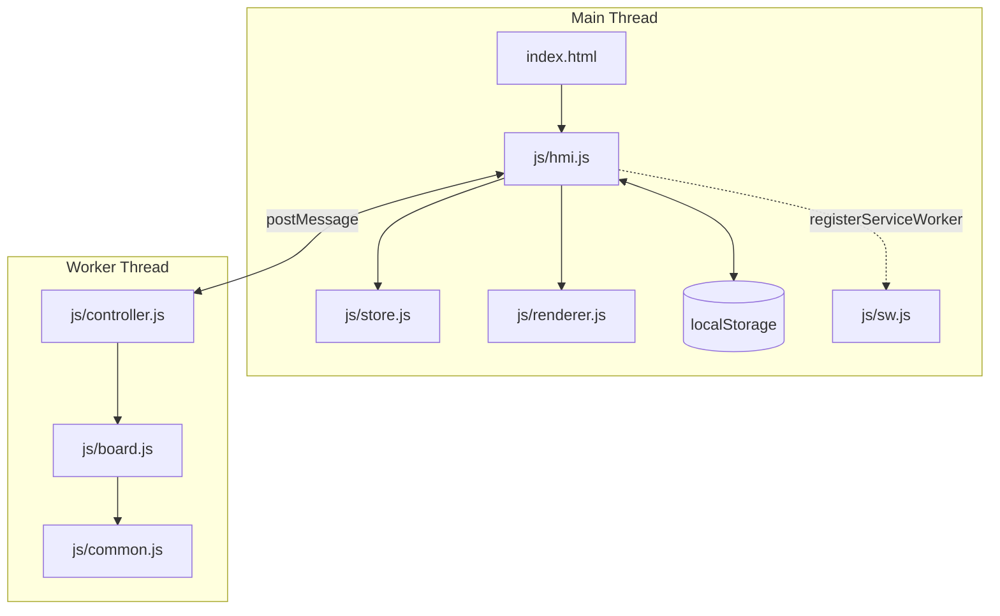
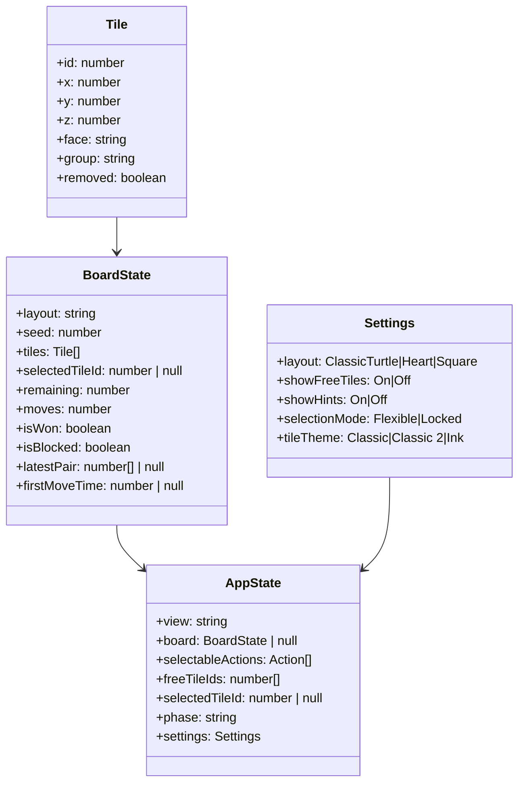
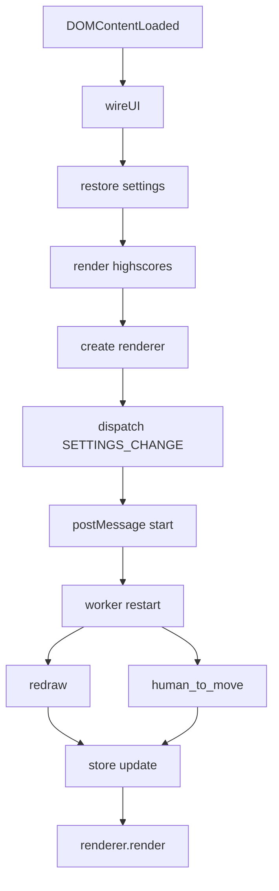
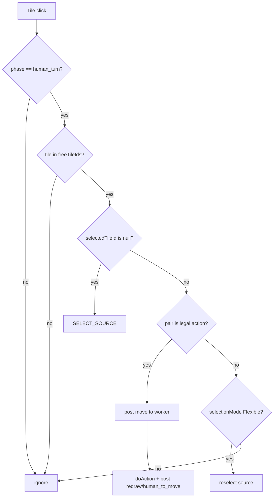
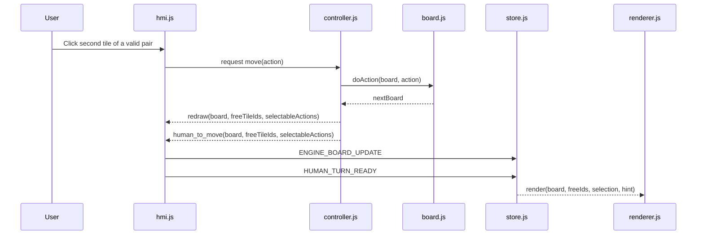
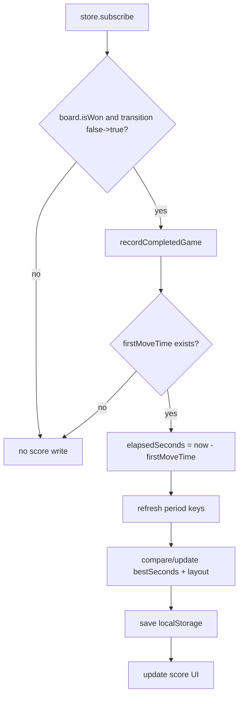

# Software Architecture - Mahjong Solitaire

## 1. System Overview

This application is a browser-only single-page game split into three layers:

- Main thread UI (`index.html`, `js/hmi.js`, `js/renderer.js`, `js/store.js`)
- Worker thread engine (`js/controller.js`)
- Pure rules core (`js/board.js`, `js/common.js`)

Core goals:

- Deterministic and testable gameplay behavior.
- Isolation of side effects (DOM, storage, worker messaging).
- Immutable state transitions.
- Explicit event/message flow between UI and rules.

## 2. Implemented Feature Set

### 2.1 Gameplay and Rules

- 144-tile Mahjong Solitaire board for each layout.
- Legal pair matching by group (including flower and season wild-group behavior by group label).
- Tile freedom rules include:
  - direct top blocking (`z + 1` tile at same `x/y`);
  - classic side locking (left and right neighbors on same `z`);
  - partial top overlap blocking (any overlap from higher layers);
  - partial same-layer side blocking for fractional coordinates with center-distance directionality.
- Board status flags:
  - `isWon` when all tiles are removed;
  - `isBlocked` when no legal action remains.

### 2.2 Layouts and Visuals

- Layouts: `ClassicTurtle`, `Heart`, `Square`.
- SVG-based renderer with layered drawing and click hit targets.
- Visual states:
  - selected tile outline;
  - free-tile highlight (optional);
  - hint pair highlight (optional).
- Tile themes: `Classic`, `Classic 2`, `Ink`.
- Responsive board scaling with CSS and SVG viewBox.

### 2.3 UI, Settings, and Persistence

- Side-panel navigation (`game`, `rules`, `options`, `about`).
- Selection modes:
  - `Flexible`: reselection allowed;
  - `Locked`: stricter selection behavior.
- Settings persisted via `localStorage` (`mahjong_user_settings`).
- Highscores persisted via `localStorage` (`mahjong_highscores`) for:
  - today;
  - week (ISO week key);
  - month.
- Highscores are time-based (`bestSeconds`) and displayed as `mm:ss (Layout)`.

### 2.4 Highscore Timing Semantics

- A board carries `firstMoveTime`.
- `firstMoveTime` is set when the first legal pair is removed.
- Completion time is measured from `firstMoveTime` until board clear (`isWon`).
- Scores are period-based and layout-aware in display and update logic.

### 2.5 Progressive Web App (PWA)

- **Web App Manifest** (`manifest.json`): Defines app metadata (name, icons, display mode, colors).
- **Service Worker** (`js/sw.js`):
  - Caches static assets on first visit (install phase).
  - Implements network-first fetch strategy with cache fallback for offline support.
  - Cleans up old cache versions on activation.
- **Installation**: Users can install the app on home screen (mobile) or as a standalone app (desktop).
- **Offline capability**: Once installed and cached, the game functions without internet connectivity.
- **Meta tags** (`index.html`):
  - `viewport`: Responsive design support.
  - `apple-mobile-web-app-capable`: iOS app-like experience.
  - `apple-mobile-web-app-status-bar-style`: Status bar styling for iOS.
  - `manifest`: Link to web app manifest.

## 3. Dependency Diagram

## 4. Domain Model Diagram

## 5. Layout Geometry and Tile Distribution

All layouts must produce exactly 144 coordinate cells before face assignment.

- Faces are generated as:
  - `34` standard types × `4` copies = `136`
  - `4` flowers + `4` seasons = `8`
  - total `144`
- `createBoard` validates `layoutCells.length === faces.length`.

Current distributions:

- `ClassicTurtle`: `z0=87`, `z1=36`, `z2=16`, `z3=4`, `z4=1`.
- `Heart`: `z0=80`, `z1=36`, `z2=16`, `z3=12`.
- `Square`: `z0=80`, `z1=36`, `z2=20`, `z3=8`.

## 6. Key Rule Algorithms

### 6.1 Tile Freedom Decision (`isTileFree`)

Decision order:

1. Reject missing/removed tile.
2. Reject if partially blocked from top (`isPartiallyBlockedByTop`).
3. Reject if partially blocked on side (`isPartiallyBlockedOnSide`).
4. Reject if exact tile exists at `(x, y, z+1)`.
5. Compute exact neighbors at `(x-1, y, z)` and `(x+1, y, z)`.
6. Tile is free unless both left and right neighbors exist.

### 6.2 Partial Overlap Logic

- Overlap uses tile footprint ranges: `[x, x+1)` and `[y, y+1)`.
- Fractional coordinates are allowed and significant.
- Same-layer side blocking is directional based on distance from current board center.

## 7. Message Protocol and State Flow

### 7.1 Worker Request/Response

Requests (`hmi.js` -> `controller.js`):

- `start`
- `restart`
- `move`
- `sync`
- `action_by_ai` (compatibility no-op)

Responses (`controller.js` -> `hmi.js`):

- `redraw`
- `human_to_move`

Payload fields used by UI:

- `board`
- `freeTileIds`
- `selectableActions`

### 7.2 Startup Flow Graph

### 7.3 Move Flow Graph

### 7.4 Sequence Diagram (Move + Render)

### 7.5 Win/Highscore Flow

## 8. Module Responsibilities

- `js/board.js`
  - layout generation
  - face generation and shuffling
  - move legality and free-tile computation
  - immutable game state transition (`doAction`)
- `js/controller.js`
  - worker endpoint for requests
  - settings normalization/validation
  - authoritative board instance and snapshot publishing
- `js/store.js`
  - pure reducer-driven app state container
  - action routing for view/selection/settings/worker updates
- `js/hmi.js`
  - DOM event wiring
  - worker communication
  - highscore and settings persistence
  - navigation and options workflows
- `js/renderer.js`
  - SVG scene construction and redraw
  - tile graphics and palettes
  - user click callbacks

## 9. Testing and Quality Gates

- Unit tests include:
  - board rules and layout invariants (`tests/unit/board.test.js`)
  - store reducer behavior (`tests/unit/store.test.js`)
  - worker orchestration (`tests/unit/controller.worker.test.js`)
  - persistence wiring (`tests/unit/hmi.persistence.test.js`)
  - utility helpers (`tests/unit/common.test.js`)
- End-to-end tests (`tests/e2e/game.spec.js`) verify user-facing flows.
- Coverage thresholds are enforced in Vitest config.

## 10. Custom Layout Guide

The full custom-layout tutorial, helper-function guidance, and worked example
have been extracted to:

- `doc/how_to_create_an_own_layout.md`

## 11. Architecture Decisions Summary

- Keep rules pure and deterministic in `board.js`.
- Keep UI side effects in `hmi.js` and rendering in `renderer.js`.
- Keep worker as the authoritative engine boundary.
- Keep settings and score persistence outside the rules engine.
- Keep layout builders declarative using point composition.
